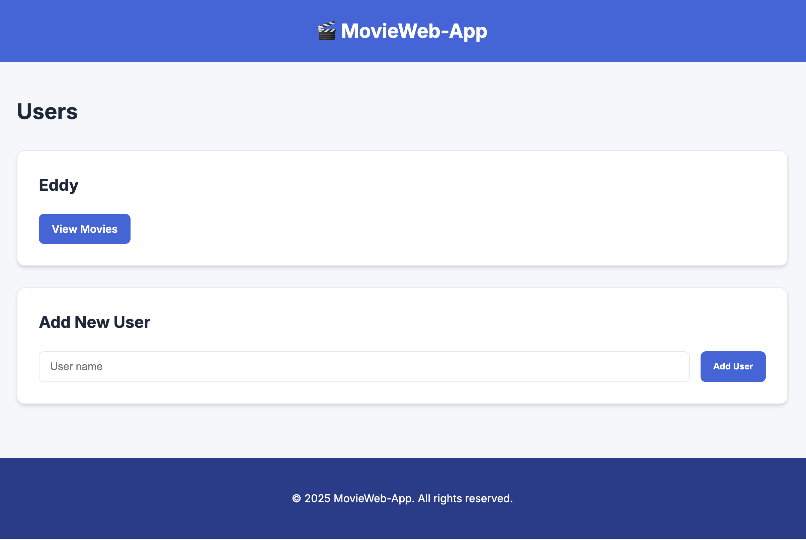
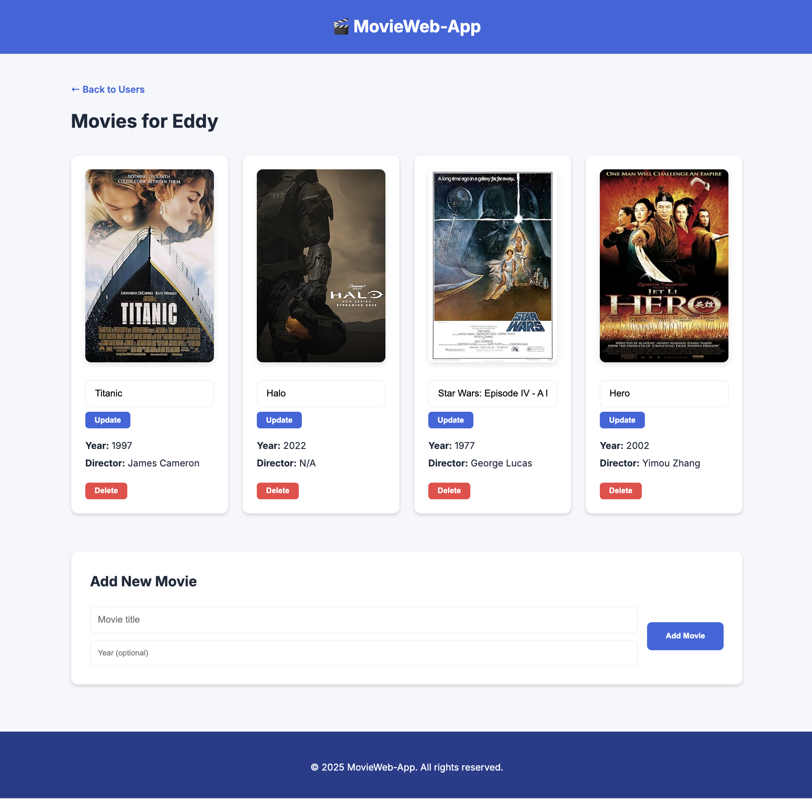
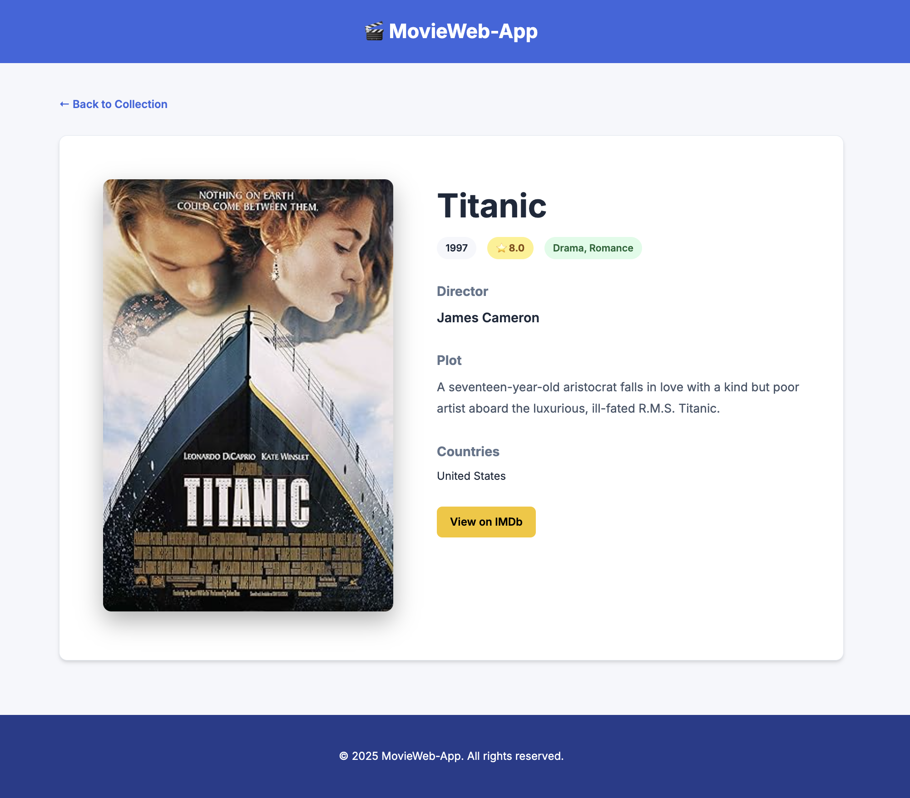

# MovieWeb-App 🎬


A modern, highly responsive movie collection management web application. **MovieWeb-App** allows users to maintain personal lists of their favorite cinema, enriched with real-time data from the **OMDB API**.

---

## 📸 Screenshots

| Home Page (Users) | Movie Collection | Movie Details |
| :---: | :---: | :---: |
|  |  |  |

---

## 📂 Project Structure

```text
.
├── app.py              # Main Flask application & Routes
├── data_manager.py     # Database CRUD operations logic
├── models.py           # SQLAlchemy Data Models (User, Movie)
├── data/               # SQLite database storage
├── static/             
│   └── style.css       # Custom modern CSS styling
├── templates/          # HTML templates (Jinja2)
│   ├── base.html       # Shared layout
│   ├── index.html      # Landing & User list
│   ├── movies.html     # User's gallery & Add form
│   ├── movie_details.html # Detailed movie info
│   ├── 404.html        # Custom Page Not Found
│   └── 500.html        # Custom Server Error
└── screenshots/        # UI Screenshots for documentation
```

---

## 🚀 Key Features

- **Multi-User Support**: Every user gets their own private sandbox for movie collections.
- **Smart OMDB Integration**: 
    - Enter a title, and the app fetches **Directors**, **Genres**, **Ratings**, and **Posters** automatically.
    - Features a robust **fallback mechanism**: if the API is down or the film is obscure, you can still enter details manually.
- **Advanced UI/UX**:
    - **Cinematic Detail Pages**: Large-scale posters and full plot descriptions.
    - **Interactive Dashboard**: Direct links to IMDb for deep dives into movie history.
    - **Responsive Design**: Optimized for wide screens and small displays alike.
- **Error Resilience**:
    - Custom-designed 404 and 500 error pages with a cinematic theme.
    - Automated database session rollbacks to prevent locking during crashes.

---

## 🛠️ Installation & Setup

1. **Clone the repository**:
   ```bash
   git clone https://github.com/lcetin66/MoviWebApp.git
   cd MoviWebApp
   ```

2. **Set up a virtual environment**:
   ```bash
   python -m venv .venv
   source .venv/bin/activate  # On Windows: .venv\Scripts\activate
   ```

3. **Install dependencies**:
   ```bash
   pip install flask flask-sqlalchemy requests python-dotenv
   ```

4. **Environment Configuration**:
   Create a `.env` file in the root directory:
   ```env
   OMDB_API_KEY=your_key_here
   SECRET_KEY=your_secret_key_here
   ```

5. **Initialize & Run**:
   ```bash
   python app.py
   ```
   Visit `http://localhost:5001` in your browser.

---

## 💡 How It Works

1. **Data Layer**: Powered by **SQLAlchemy ORM**, managing a one-to-many relationship between Users and Movies.
2. **API Layer**: Uses the `requests` library to fetch JSON data from OMDB. It parses the data and gracefully handles missing fields or connection timeouts.
3. **Template Layer**: Built with **Jinja2**, using a base layout to ensure consistent look and feel across all cinematic scenes.

---

## 📄 License

Distributed under the MIT License. See `LICENSE` for more information.
